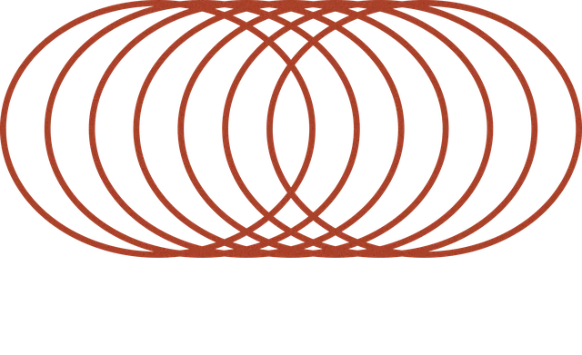
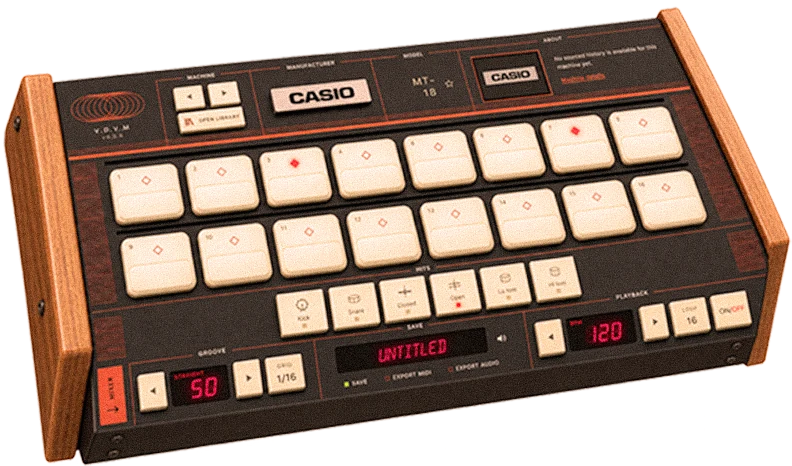

<p align="center">
  
</p>

<p align="center">
  <b>Vintage Drum Virtual Machine</b><br>
  A 16-step drum machine for recorded samples of vintage drum machines.<br>
  In the browser, or as a VST3 / AU plugin.
</p>

<p align="center">
  <a href="https://re20.one">Open the web app</a> ·
  <a href="https://vdvm.crnst8.com">Download the plugin</a>
</p>

<p align="center">
  
</p>

## Install the plugin (macOS)

1. Download an installer from [vdvm.crnst8.com](https://vdvm.crnst8.com). The one with samples includes the sample library; the other is the plugin alone.
2. Open the `.pkg`. The installers are not signed yet: if macOS blocks it, open **System Settings → Privacy & Security** and choose **Open Anyway**.
3. Rescan plugins in your DAW and load **V.D.V.M** on an instrument track.

| What | Where |
|---|---|
| VST3 | `/Library/Audio/Plug-Ins/VST3/V.D.V.M.vst3` |
| AU | `/Library/Audio/Plug-Ins/Components/V.D.V.M.component` |
| Sample library | `/Library/Application Support/V.D.V.M/Factory` |
| Your patterns, presets and libraries | `~/Library/Application Support/V.D.V.M` |

To uninstall, delete the first three. The plugin follows the host's tempo; the **TEMPO** key switches to its own.

## Run the web app

Needs Node 24.

```bash
npm ci
npm run dev
```

It starts with three generated test kits. To play your own samples:

```bash
npm run catalog:folder -- ~/Samples/Drums
npm run dev
```

Each folder of WAV files becomes a kit. The first folder level names the machine (`Roland TR-909`), deeper folders name the kit. `npm run build` writes a static site to `dist/`.

## Build the plugin

Needs macOS, Xcode, CMake 3.25+ and Node 24.

```bash
npm ci
plugin/dev build
plugin/dev install
```

More in [plugin/README.md](plugin/README.md).

## Check a change

```bash
npm run check      # catalog, types, tests, build
plugin/dev check   # plugin build, tests, host test, pluginval
```

Keep the audio trigger path synchronous: nothing between a hit and `start()` (or the plugin's `processBlock`) may fetch, decode, read storage or wait.

## Layout

| Path | What |
|---|---|
| `src/` | Web app: React UI, Web Audio engine, storage, service worker |
| `plugin/` | Native plugin (JUCE 8); its UI is the web app in a WebView |
| `catalog/schema/` | The catalog format; `npm run catalog:types` regenerates `src/contract/types.ts` |
| `scripts/catalog/` | Catalog build, validation, folder import, test kits |
| `tests/` | Vitest |
| `deploy/` | Production: the media container and the scripts the workflows run on the servers ([docs/DEPLOY.md](docs/DEPLOY.md)) |

[docs/OVERVIEW.md](docs/OVERVIEW.md) explains how the parts fit together.
