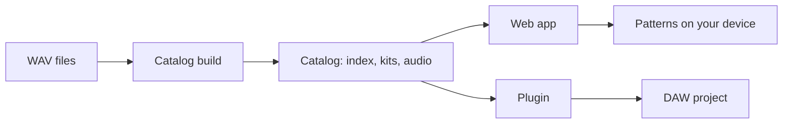

# How V.D.V.M works

V.D.V.M is a 16-step drum machine. You pick a sound from the instrument strip, then press the step keys to set when it plays. All parts loop together over one bar. Phones show eight steps at a time; desktops show all sixteen.

## Parts

- **Catalog.** A folder of JSON and audio: `catalog/index.json` lists machines and kits, each kit lists its slots and samples, and audio files are named by their SHA-256. The format is in `catalog/schema/`. `scripts/catalog/build.ts` makes a catalog from source records, and `validate.ts` checks one.
- **Web app** (`src/`). Loads the catalog from `VITE_CATALOG_BASE`, prepares one kit at a time in memory, and plays it with Web Audio. Patterns and an unsaved draft live in IndexedDB; a service worker keeps the app working offline.
- **Plugin** (`plugin/`). The same UI in a WebView, with sound, kit loading and project state in C++. It reads the same catalog format from disk.

## Timing

A kit plays only after every sound in it is downloaded and decoded. A hit never waits for the network or the disk. The audio clock schedules each step ahead of time; screen animation only reads it. In the plugin, steps follow the host's bar and tempo.

## Kits and patterns

Kit, sample and machine IDs are permanent. A pattern stores the kit ID and the sample chosen for each slot. If a sample is missing, that slot stays silent; nothing else is substituted. A kit switch while playing takes effect at the next bar.

## The published site

[re20.one](https://re20.one) is the web app. Its sample library is served from media.re20.one and built from a private archive that is not in this repository. [docs/DEPLOY.md](DEPLOY.md) describes the hosting.
